# Velocity Rental (Car Rental API)


## Project Description
VelocityRental is an API built with .NET 9, following a Cloud Native architecture and ready for deployment on any cloud provider supporting .NET 9.
The API enables car rental and return operations, and calculates rental prices and customer loyalty points based on flexible business rules.

Scope: MVP

## Technologies Used

### Platform & Language
- **NET 9**: Latest Microsoft framework with cloud native features and performance improvements
- **C# 14**: Leveraging the latest language features for clean and efficient code

### Database
- **SQLite**: Temporary solution for this MVP.

### Tools & Frameworks
- **Visual Studio 2022**: Main IDE for development
- **Entity Framework Core 9.0**: ORM for data access layer
- **Swagger/OpenAPI**: Automatic API documentation and testing

### Testing
- **xUnit**: Unit testing framework
- **Moq**: Dependency mocking
- **FluentAssertions**: Readable assertions for tests

## Architecture

### Clean Architecture

The application follows a Clean Architecture pattern with clear separation of concerns across multiple layers.

1. **Core Layer (Domain Layer)**:

The Core project contains the domain model, business logic, and interfaces that define the contracts for the outer layers:

- Domain Entities: Represent the business objects like Car, Customer, Rental
- Domain Services: Encapsulate complex business logic
- Repositories Interfaces: Define contracts for data access
- Domain Logic: Includes pricing strategies and business rules
  
2. **Infrastructure Layer**:

The Infrastructure project handles data persistence and implements the repository interfaces defined in the Core layer:

- Database Context: Entity Framework Core implementation
- Repository Implementations: Data access logic
- Migrations: Database schema evolution

3. **API Layer (Presentation Layer)**:

The API project exposes the functionality through RESTful endpoints:

- Minimal API Endpoints: Using .NET 9's minimal API approach
- Dependency Injection: Wiring up services and repositories
- Configuration: Application settings and middleware


## Design Patterns:

1. **Repository Pattern**:
The Repository pattern is used to abstract data access logic from the business logic. It provides a collection-like interface for accessing domain objects.

2. **Strategy Pattern**:
The Strategy pattern is used for implementing different pricing strategies for different car types. This allows the application to switch between different pricing algorithms at runtime.

3. **Factory Pattern**:
The Factory pattern is used to create pricing strategy objects without exposing the instantiation logic to the client code.

4. **Dependency Injection Pattern**:
The Dependency Injection pattern is used throughout the application to provide dependencies to classes rather than having them create or find dependencies themselves.

5. **Mediator Pattern (Minimal API Endpoints)**:
The application uses a form of the Mediator pattern through its API endpoint organization, where endpoint handlers act as mediators between HTTP requests and domain services.

6. **Domain-Driven Design**:
While not a design pattern in the traditional sense, DDD is an architectural approach that focuses on domain modeling (core domain and domain logic).

## Database



## Quick Start: How to Test the API

1. **Run the API**
   - Start the project
     - From source code: run `dotnet run` in the project folder, or use Visual Studio/VS Code
     - From the GitHub .zip release package: extract the zip, open a terminal in that directory, and run `dotnet CarRentalApi.Api.dll`.
   - Open the Swagger UI by using any browser and navigating to `https://localhost:8080/swagger`.

3. **Initialize Master Data**
   - Go to the `Master Data` section in Swagger.
   - Use the `POST /api/MasterData/initialize` endpoint to create demo cars, pricing, and customers.
   - You will see a confirmation message when initialization is complete.

4. **Check Master Data Status (Optional)**
   - Use `GET /api/MasterData/status` to verify if the database is initialized.

5. **Rent a Car**
   - Go to the `Renting Operations` section in Swagger.
   - Use `POST /api/Rental` to create a new rental. Provide a valid customer and car ID (from the initialized data).
  ```
  {
     "carId": "11111111-1111-1111-1111-111111111111",
     "customerId": "aaaaaaaa-aaaa-aaaa-aaaa-aaaaaaaaaaaa",
     "startDate": "2025-05-12T08:16:00.911Z",
     "endDate": "2025-05-16T08:16:00.911Z"
  }
  ```     
   - On success, you'll get the rental details and a unique rental ID.

5. **Return a Car**
   - Use `POST /api/Rental/{id}/return` with the rental ID from the previous step.
   - You can provide a return date if you want to simulate a specific return scenario; if you do not provide a date, today's date will be used by default. *This is important for testing late returns or other behaviors.*
   - On success, you'll get the updated rental with return info and any fees.

6. **(Optional) Clean All Data**
   - Use `POST /api/MasterData/clean` to delete all data and reset the system.

**Tip:**
- You can always re-initialize the master data after cleaning.
- All endpoints can be tested directly from Swagger UI.

---

## Possible Future Improvements

- **Loyalty Points Tracking History:**
  Currently, loyalty points are simply accumulated as an integer field for each customer, without tracking the specific rental from which each set of points was earned. In future iterations, a dedicated table could be introduced to record a history of loyalty points awarded per rental. This would allow the system to trace the origin of each set of loyalty points, provide detailed breakdowns to users, and enable more advanced reporting or loyalty program features. The final balance could then be calculated as the sum of all historical entries, offering full transparency and auditability.

- **Additional Fees Extensibility:**
  The system currently supports only the most important additional fee type (late return) for the MVP, as represented by the `FeeTypeEnum` and the `AdditionalFees` list in the `Rental` entity. Other fee types (such as baby seat, GPS, cross-border, etc.) might be part of future extensibility but are not yet implemented. In future iterations, the enum and related logic can be expanded to support a wider range of additional fees, enabling more flexible pricing and richer rental scenarios.

Miscellaneous:

- Migration to NoSQL storage.
- Distributed anti-collision/locking (e.g., Redis)
- Integration tests and E2E scenarios
- Advanced monitoring and logging
- Security, authentication, and authorization
- More granular validation and error handling
- More unit tests :)

---
